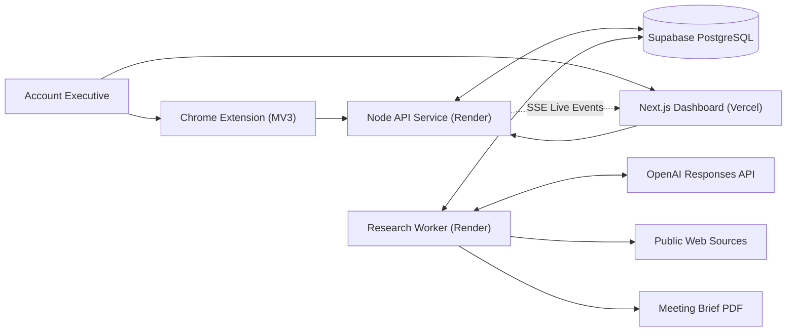

# Switchpath — Steerable Sales Research AI Employee

> **An AI employee that learns how an Account Executive researches a prospect, executes that workflow autonomously using live public sources, and allows real-time redirection from any webpage via a Chrome extension.**

---

## 💡 The Core Problem & Product Insight

Existing AI research tools operate as black boxes. When an Account Executive (AE) discovers a better source, a recent news article, or an updated sustainability report while browsing, redirecting standard AI agents requires restarting the entire workflow or fighting rigid prompts.

**Switchpath solves this with a steerable, human-on-the-loop agent:**
1. **Teaches through observation or written playbooks**
2. **Executes live research bounded by evidence rules**
3. **Accepts ambient human intervention (Ctrl+Shift+Y on any webpage)**
4. **Pauses, compares the old vs. proposed research route, and waits for approval**
5. **Increments the plan revision and invalidates ONLY dependent conclusions**
6. **Saves approved corrections as reusable future workflow rules**

---

## ⚡ Key Architecture & Highlights

- **Deterministic Agent Orchestrator**: The AI model proposes bounded research actions, but application code strictly controls permissions, approvals, state transitions, and persistence.
- **Revision Fencing**: Every claim, action, and report carries a `plan_revision` number. Obsolete results from older routes are rejected automatically.
- **Evidence Transparency**: Every finding is classified as a **Sourced Fact**, **Agent Interpretation**, or **Unsupported Hypothesis**, with direct citations.
- **Chrome MV3 Ambient Companion**: Hotkey capture (`Ctrl+Shift+Y`) for current URL, page title, selected text, and voice-to-text instructions.
- **Durable Event Streaming**: Built on Supabase PostgreSQL & Server-Sent Events (SSE) so research continues seamlessly even if the dashboard reloads.

---

## 📐 System Architecture



---

## 📁 Product Specifications & Documentation Index

All detailed product requirements, system design specs, and security guardrails are maintained in the [`/docs`](./docs) directory:

| Document | Description |
|---|---|
| 📄 [**Product Scope**](./docs/PRODUCT_SCOPE.md) | Persona definition (Sales AE), core problem, JTBD, supported research sources, and MVP success criteria. |
| 📋 [**Product Requirements Document (PRD)**](./docs/MVP_STRUCTURE.md) | Complete end-to-end spec, 6-step research playbook, Chrome overlay states, intervention types, and screen architecture. |
| 🏗️ [**System Architecture**](./docs/SYSTEM_ARCHITECTURE.md) | Tech stack breakdown, state machine specs, pause/resume engine, revision fencing, and live SSE event engine. |
| 🤖 [**Agent Orchestrator**](./docs/AGENT_ORCHESTRATOR.md) | Deterministic control plane, OpenAI Responses API contract (`gpt-5.6-luna`), and evidence guardrails. |
| 🛡️ [**Live Research Tools**](./docs/LIVE_RESEARCH_TOOLS.md) | Web discovery, public page extraction, SSRF security controls, domain blacklists, and rate limits. |
| 🗄️ [**Data Model**](./docs/DATA_MODEL.md) | Supabase schema (18+ tables), SQL migrations, claim-evidence graph mapping, and audit events. |
| 🎨 [**Design System**](./docs/DESIGN_SYSTEM.md) | Visual design tokens, typography system (Geist Sans / Geist Mono), and UI layout principles. |

---

## 🛠️ Tech Stack & Monorepo Topology

This repository is structured as a TypeScript monorepo using npm workspaces:

```text
Switchpath/
├── apps/
│   ├── web/          Next.js dashboard (Vercel)
│   ├── api/          Express REST & SSE API server (Render)
│   ├── worker/       Persistent background research loop (Render)
│   └── extension/    Chrome Manifest V3 ambient extension
├── packages/
│   ├── agent/        Agent policies, orchestrator, tools, and OpenAI adapters
│   ├── database/     Supabase queries and migration utilities
│   └── shared/       Shared Zod schemas, types, and event contracts
└── docs/             Complete product requirements & system architecture
```

- **Frontend**: Next.js 16, React 19, TailwindCSS, Geist Fonts
- **Backend**: Node.js, Express, TypeScript, Server-Sent Events (SSE)
- **Database**: Supabase (PostgreSQL) with RLS policies and RPC functions
- **AI Runtime**: OpenAI Responses API (`gpt-5.6-luna` / `gpt-5.6-terra`)
- **PDF Export**: Python PDF generator + TypeScript wrapper

---

## 🚀 Quick Start & Local Development

### Prerequisites
- Node.js `>=22.13.0`
- npm `>=10.0.0`
- OpenAI API Key

### 1. Clone & Install Dependencies
```bash
git clone https://github.com/your-username/switchpath.git
cd switchpath
npm install
```

### 2. Configure Environment Variables
Copy `.env.example` to `.env` in the root directory:
```bash
cp .env.example .env
```
Fill in your `OPENAI_API_KEY`, `SUPABASE_URL`, and `SUPABASE_SERVICE_ROLE_KEY`.

### 3. Run Development Servers
```bash
# Terminal 1: API Server
npm run dev:api

# Terminal 2: Background Research Worker
npm run dev:worker

# Terminal 3: Web Dashboard
npm --prefix apps/web run dev
```

Dashboard will be available at `http://localhost:3000`.

---

## ☁️ Deployment Guide

- **Frontend (`apps/web`)**: Deployed on **Vercel** (`Root Directory: apps/web`). See [`apps/web/vercel.json`](./apps/web/vercel.json).
- **Backend Services (`apps/api` & `apps/worker`)**: Deployed on **Render** using the root [`render.yaml`](./render.yaml).

---

## 📜 License

MIT License. Built for portfolio demonstration.
