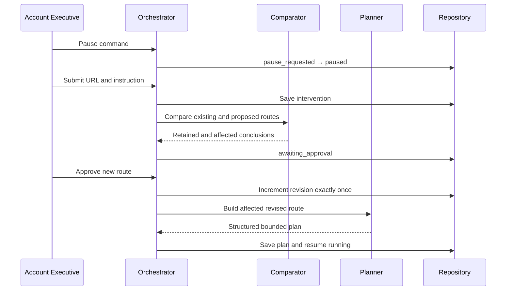

# Switchpath MVP — Agent Orchestrator

## Purpose

The orchestrator is the control plane for a research employee. It lets an AI plan and perform bounded research tasks without letting the model control persistence, approvals, run state, permissions or evidence policy.

The implemented loop is:

```text
Read durable run state
  → claim one durable command, if present
  → otherwise advance one bounded state or action
  → validate the result and revision
  → persist an event
  → stop at pause, approval, completion or failure
```

One `tick` performs at most one meaningful unit. `runUntilBlocked` repeats ticks only until a human or terminal boundary is reached.

## Implemented Components

- `AgentOrchestrator`: deterministic state, command and action control.
- `ResearchPlanner`: model boundary for initial and approved revised plans.
- `ResearchActionExecutor`: bounded execution boundary for the live research tools built next.
- `InterventionComparator`: source-route comparison boundary.
- `AgentRepository`: persistence contract shaped for the Step 4 Supabase schema.
- `InMemoryAgentRepository`: local test implementation; it is not the production persistence layer.
- `OpenAIResearchPlanner`: Responses API adapter using strict JSON-schema output.

## Agentic Boundary

The model may:

- Propose a goal-specific research plan.
- Select bounded research action types.
- Express dependencies and completion criteria.
- Propose a revised route after an approved intervention.
- Later choose search queries, sources and evidence within an action.

Application code always controls:

- Which commands are legal in the current state.
- Whether a plan revision is current.
- Whether an action may start.
- Maximum plan size and dependency validity.
- Pause, resume, cancel, retry and approval transitions.
- Evidence requirements for facts and interpretations.
- Persistence and audit events.

This separation is what makes the system agentic without making it uncontrolled.

## Pause During an Active Action

1. The product stores the Pause command first.
2. The local orchestrator signals the active action's `AbortController`.
3. An abortable action stops and returns to `pending`, so Resume can safely retry it.
4. The orchestrator records `action.interrupted`.
5. It consumes the durable Pause command and moves to `pause_requested`.
6. At the safe checkpoint it moves to `paused` and preserves `resume_status`.

If a remote request cannot abort, the durable command remains the fallback. Its result must pass the run-status and revision fence, and no subsequent action can start before the pause is applied.

## Source-Change Route



Rejecting the route preserves the existing revision and returns to the paused run. Approving it increments the revision before replanning, so late work from the previous route cannot become current.

## OpenAI Planning Contract

The local adapter uses the Responses API with:

- Model: `gpt-5.6-terra` by default.
- Reasoning effort: `medium` by default.
- Strict JSON-schema output.
- No API-side response storage.
- A maximum of 12 atomic actions.
- Explicit public-source, evidence and prompt-injection rules.

The API key is constructor-injected and is never placed in a plan, event, error message or client bundle. The request shape follows the official OpenAI documentation for the [Responses API](https://developers.openai.com/api/docs/guides) and [GPT-5.6 Terra](https://developers.openai.com/api/docs/models/gpt-5.6-terra).

## Evidence Guardrails Enforced Now

- A sourced fact without evidence fails the atomic action.
- An interpretation without both evidence and concise rationale fails the action.
- Confidence must be between zero and one.
- Unsupported hypotheses may be stored only under their explicit label.
- An invalid result never silently becomes a verified claim.

## Audit Events

The loop currently emits:

- `run.started`
- `plan.created`
- `action.started`
- `action.completed`
- `action.interrupted`
- `action.discarded`
- `run.pause_requested`
- `run.paused`
- `intervention.submitted`
- `intervention.compared`
- `intervention.approved`
- `intervention.rejected`
- `plan.revised`
- `run.resumed`
- `run.completed`
- `run.failed`
- `command.rejected`

## Current Boundary

Step 5 implements and tests the orchestration engine. It does not pretend that live research already exists.

Connected in Step 6:

- Public web-search discovery.
- SSRF-safe public page extraction.
- Exact evidence extraction and claim synthesis.
- Normalized source, evidence and claim persistence contract.

Still to connect:

- Supabase implementation of `AgentRepository`.
- Backend worker process and API routes.
- Dashboard event stream.

Those pieces can now be added behind stable interfaces without changing the pause/replan state machine.

## Local Verification

```powershell
npm.cmd run typecheck:agent
npm.cmd test
```

The critical integration test executes the complete pause → submit source → compare → approve → revision 2 → resume → complete route.
