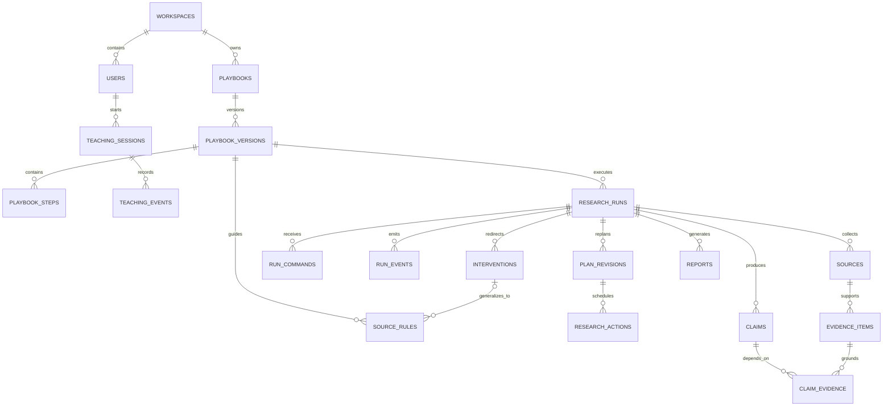
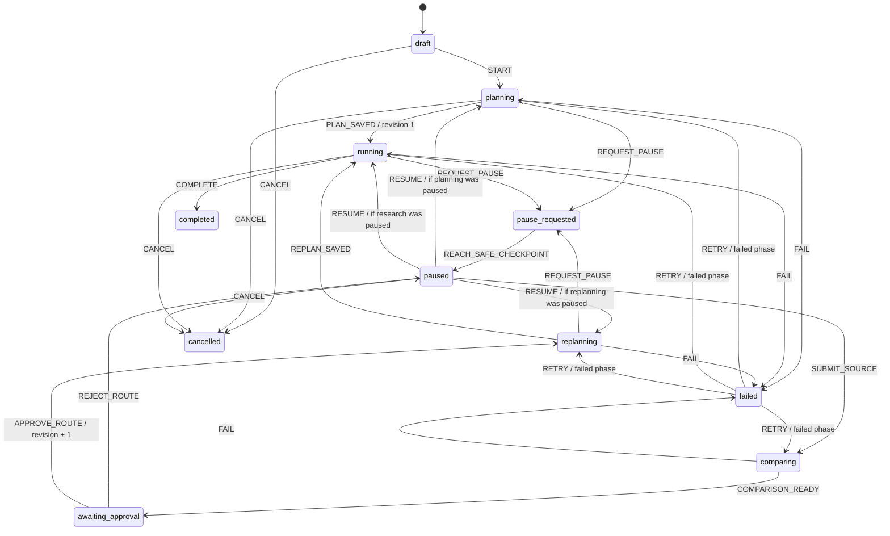

# Switchpath MVP — Research Data Model and State Machine

## Purpose

This model makes research durable, interruptible and auditable. The browser and dashboard are clients of the run; neither owns the run. Supabase PostgreSQL is the source of truth for the workflow, evidence, commands, revisions and output.

## Domain Map



## Record Groups

### Workspace

- `workspaces`: the persistent demo workspace; already shaped for future multi-workspace support.
- `users`: the account executive operating that workspace.

### Workflow Learning

- `teaching_sessions`: an explicitly started observation or written-instruction session.
- `teaching_events`: ordered Chrome navigation, search, selection and user-note events.
- `playbooks`: the reusable workflow identity.
- `playbook_versions`: proposed and approved changes; an approved change never silently overwrites history.
- `playbook_steps`: ordered research objectives.
- `source_rules`: generalized behavior such as finding an official sustainability page for each prospect rather than remembering a Blinkit URL.

### Live Research

- `research_runs`: account, meeting context, goal, run status and current revision.
- `plan_revisions`: complete immutable plans for each route revision.
- `research_actions`: atomic tool calls with leases, idempotency keys, inputs and outputs.
- `run_commands`: durable pause, resume, cancel and submit-source commands from the dashboard or extension.
- `run_events`: append-only event stream for the audit log and live dashboard reconnection.

### Evidence and Reasoning

- `sources`: every public page considered, including sources introduced by the AE.
- `evidence_items`: exact excerpts and their location, relevance and credibility.
- `claims`: facts, interpretations and unsupported hypotheses.
- `claim_evidence`: the dependency graph linking a claim to supporting, conflicting or contextual evidence.

### Intervention and Output

- `interventions`: proposed source, instruction, comparison, approval and memory decision.
- `reports`: one structured dashboard/PDF payload for each completed plan revision.

## Research-Run State Machine



`completed` and `cancelled` are terminal. A failed run can retry only after an explicit retry command from the product layer. `resume_status` remembers the phase interrupted by a pause, while `retry_status` independently remembers the phase that failed. Keeping those concerns separate prevents a failed source comparison from forgetting that the final destination is the paused research run.

The transition rules exist in two places deliberately:

1. `packages/shared/src/run-state-machine.ts` provides a typed rule set for the API and worker.
2. The PostgreSQL migration installs a trigger that rejects invalid direct database transitions.

The database trigger protects the invariant even if an application bug bypasses the TypeScript helper.

## Pause Semantics

Pause is a durable command, not a frontend flag.

1. The dashboard or extension inserts `run_commands(kind = pause)`.
2. The API updates the current active phase to `pause_requested` and records that phase in `resume_status`.
3. The worker notices the command or cancellation signal.
4. The current action aborts where possible or reaches a safe checkpoint.
5. The worker records whether its result was accepted or discarded.
6. The run moves to `paused`.
7. No pending action may start until the run resumes its recorded phase.

Closing Chrome or the dashboard does not remove the command or run state.

## Revision Fencing

`research_runs.plan_revision` is the current authority.

- The first approved plan is revision 1.
- Rejecting an intervention keeps the existing revision.
- Approving a different route increments the revision immediately, before replanning starts.
- Every action, source, evidence item, claim and report records its plan revision.
- A worker may persist an action result only if its starting revision still matches the run revision.
- A late result from an earlier revision is marked `discarded` and cannot affect claims or reports.

This gives cancellation a reliable fallback even when an external request cannot stop instantly.

## Selective Claim Invalidation

The system never deletes old evidence when the route changes.

```text
Source
  → Evidence item
      → claim_evidence relationship
          → Claim
```

When new evidence conflicts with an existing source:

1. Find claims connected to the affected evidence.
2. Mark those claims `stale` with a reason.
3. Preserve unrelated active claims.
4. Generate replacement claims under the new plan revision.
5. Link a replacement to the prior claim through `replaces_claim_id`.

This graph is what lets Switchpath repair only the affected research route instead of restarting the entire account.

## Evidence Rules

- A sourced fact must be linked to at least one supporting evidence item before report generation.
- An agent interpretation must contain a rationale and link to the evidence used to derive it.
- An unsupported hypothesis may have contextual evidence but is always visibly labelled unverified.
- Conflicting evidence is stored with the `contradicts` relationship rather than removed.
- URLs, excerpts and retrieval timestamps remain in the audit history.

The database preserves the relationships; the report-generation service will enforce the final claim completeness rules before producing a PDF.

## Single Active Run

A partial unique PostgreSQL index allows only one run in an execution state per workspace:

- planning
- running
- pause requested
- paused
- comparing
- awaiting approval
- replanning

Draft, completed, failed and cancelled runs do not occupy the active slot. This is enforced atomically in PostgreSQL, so two near-simultaneous Start requests cannot create parallel active runs.

## Worker Recovery

Each action has:

- An idempotency key
- A worker lease owner
- A lease expiration
- A durable status
- Stored input and output

After a Render worker restart, the replacement worker can reclaim an expired running action, compare its revision to the run, and resume from the last valid checkpoint.

## Access Boundary

Row-level security is enabled on every product table with no public policies in the initial migration. This intentionally denies direct anonymous/client access. Only the trusted backend service-role connection may read and write product records during the single-workspace MVP.

User-facing authorization will remain in the API. Full Supabase user authentication and workspace policies are deferred until multi-user support.

## Local Files

- PostgreSQL migration: `supabase/migrations/20260813160000_initial_switchpath.sql`
- Shared domain types: `packages/shared/src/domain-types.ts`
- State machine: `packages/shared/src/run-state-machine.ts`
- State-machine tests: `packages/shared/src/run-state-machine.test.ts`

## Step 4 Completion Test

Step 4 is complete when:

1. The PostgreSQL migration defines every durable MVP record.
2. Invalid run-state transitions are rejected in both TypeScript and PostgreSQL.
3. An approved intervention increments the plan revision exactly once.
4. A result from an old revision is rejected.
5. One workspace cannot have two active runs.
6. Evidence-to-claim dependencies can identify affected conclusions.
7. Domain-state tests pass locally.
