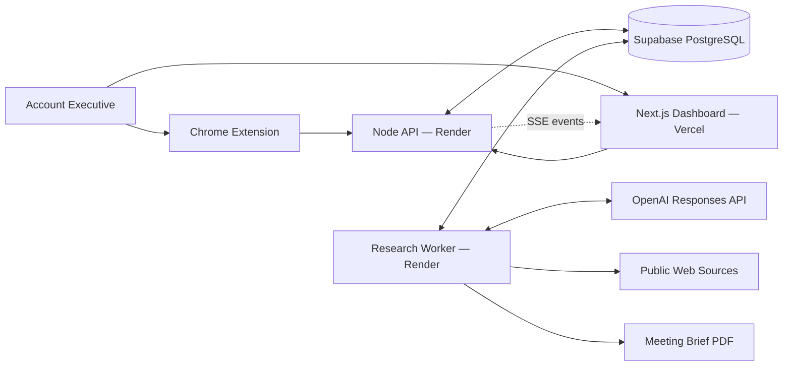
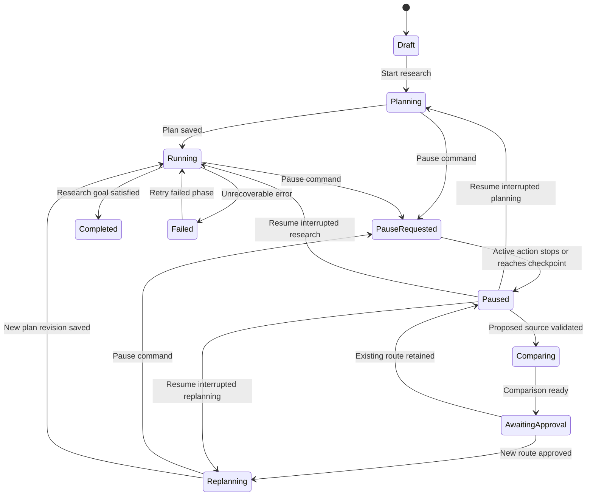

# Switchpath MVP — System Architecture and Technology Stack

## Architecture Goal

Build a live, company-agnostic sales-research agent that can learn an account executive's workflow, continue working in the background, expose its progress, and safely pause, compare, replan, and resume when the account executive introduces a better source.

## Final Stack

| Layer | Technology | Responsibility |
| --- | --- | --- |
| Web application | Next.js + TypeScript | Dashboard, Teach Mode review, playbooks, active research, evidence, reports |
| Frontend hosting | Vercel | Hosts the Next.js application |
| Browser companion | Chrome Manifest V3 extension | Teaching observation, current-page capture, hotkey overlay, pause and intervention |
| Backend API | Node.js + TypeScript on Render | Commands, validation, access control, live events, report endpoints |
| Research worker | Persistent Node.js process on Render | Agent loop, tools, pause handling, replanning, retries, report generation |
| Database | Supabase PostgreSQL | Durable workflows, runs, evidence, claims, revisions, events and reports |
| Agent runtime | OpenAI Responses API | Planning, tool selection, evidence analysis, structured claims and replanning |
| Initial model | Configurable; GPT-5.6 Terra with medium reasoning as the default | Balances research quality, reasoning capability and cost |
| Live updates | Server-sent events | Streams durable run events to the dashboard |
| Voice input | OpenAI transcription API | Converts intervention audio to editable text before confirmation |
| Reports | Server-side PDF generator | Produces the complete evidence-backed meeting brief |

Official OpenAI guidance recommends the Responses API for reasoning, tool calling and multi-turn workflows. GPT-5.6 Terra supports function calling, structured outputs and web search while targeting a balance of intelligence and cost.

- https://developers.openai.com/api/docs/guides/latest-model
- https://developers.openai.com/api/docs/models/gpt-5.6-terra

## System Map



## Deployment Units

The project will be a TypeScript monorepo:

```text
apps/
  web/          Next.js dashboard deployed to Vercel
  api/          Render web service for REST endpoints and SSE
  worker/       Render background worker for research execution
  extension/    Chrome Manifest V3 extension
packages/
  shared/       Shared Zod schemas, types and event contracts
  agent/        Agent policies, tools and orchestration logic
  database/     Supabase queries and migrations
  reports/      Meeting-brief data model and PDF renderer
```

The API and worker use the same shared packages but run as separate processes. Closing the dashboard therefore cannot terminate an active research job.

## Workspace and Access Model

The MVP uses one persistent demo workspace and one demo account executive profile.

- The web application is protected by a simple private access code.
- The Chrome extension receives a revocable pairing token for the demo workspace.
- Database tables include `workspace_id` and `user_id` from the beginning.
- Full registration, organizations, invitations and role management are deferred.

## Research Execution Model

Switchpath executes research as a sequence of small, durable actions. The model chooses the next bounded tool; the worker executes it and saves the observation before asking for another decision.

```text
Read current state
  → check pause/intervention commands
  → ask agent for next action
  → execute one allowed tool
  → save source, evidence and event
  → evaluate progress
  → repeat or finish
```

The first tool set is intentionally bounded:

- `search_web`
- `open_public_page`
- `extract_evidence`
- `compare_evidence`
- `create_or_update_claim`
- `suggest_plan_change`
- `ask_for_approval`
- `complete_research`

The agent decides which tool to use and when the research is sufficient. The orchestrator controls permissions, limits, persistence, pausing and approval gates.

The Step 5 implementation of this control loop and its OpenAI planning boundary is documented in `AGENT_ORCHESTRATOR.md` and lives in `packages/agent`.

## Run State Machine



Supported persisted statuses:

- `draft`
- `planning`
- `running`
- `pause_requested`
- `paused`
- `comparing`
- `awaiting_approval`
- `replanning`
- `completed`
- `failed`
- `cancelled`

## Pause and Background Operation

The worker checks the durable run status before every action and after every external call.

When Pause is requested:

1. The API writes `pause_requested` to the run.
2. The API signals the local worker when available.
3. The worker aborts the active HTTP or model request using an abort signal where supported.
4. No new action can start.
5. A late result is checked against both the current plan revision and run phase before it can be saved.
6. The run becomes `paused` at a safe checkpoint.

The database—not browser memory—is the source of truth. The dashboard and extension can reconnect and recover the current state after being closed.

## Revision Fencing

Every plan, action, claim and report carries a `plan_revision` number.

If an action begins under revision 1 and the AE approves a new route that creates revision 2, any late revision-1 result is rejected. This prevents cancelled or obsolete work from overwriting the new route.

## Source Intervention Flow

1. The Chrome hotkey opens the Switchpath overlay.
2. The extension captures the active run, URL, page title and selected text.
3. The AE gives a typed or spoken instruction.
4. Spoken input is transcribed and remains editable.
5. The AE confirms the intervention.
6. The backend pauses the run and validates the public URL.
7. The worker compares the existing route with the proposed source.
8. The dashboard and extension show the expected changes.
9. The agent waits for explicit approval.
10. Approval creates a new plan revision and invalidates only dependent claims.
11. The agent resumes from the earliest affected research step.
12. At completion, the AE chooses one-time use or a generalized future rule.

The original source and its conclusions remain in the audit trail.

## Teach Mode Architecture

Teach Mode is an explicit Chrome recording session.

### Captured automatically

- Page URL
- Page title
- Navigation order
- Search queries visible in supported search pages
- Time and session sequence

### Captured only through explicit user action

- Selected passages
- A page marked as useful
- A note explaining why a source or action matters

### Never intentionally captured

- Passwords
- Payment fields
- Browser settings or protected Chrome pages
- Browsing outside the active teaching session
- Unrelated tab content

When teaching finishes, the backend converts the observed trace into a draft playbook. The AE reviews, edits and approves it before it is saved.

The secondary teaching method accepts written workflow instructions and converts them into the same draft-playbook structure.

## Public Research Tools

The initial system uses:

1. OpenAI's built-in web search for discovery and source selection.
2. A controlled public-page extractor on the Render backend for readable HTML pages.

The extractor will:

- Allow only HTTP and HTTPS public URLs.
- Reject local, private-network and cloud-metadata addresses.
- Apply redirect, response-size and timeout limits.
- Record canonical URL, title, retrieval time and extracted text.
- Preserve the exact excerpt used as evidence.
- Report blocked, inaccessible or unsupported pages transparently.

External scraping services, logged-in websites and paywalled sources are deferred.

The Step 6 implementation and security contract are documented in `LIVE_RESEARCH_TOOLS.md` and live in `packages/agent/src`.

## Evidence and Claim Model

Evidence and conclusions are stored separately.

```text
Source
  → Evidence excerpt
      → Sourced fact
      → Agent interpretation
      → Unsupported hypothesis
```

Each interpretation keeps links to the evidence from which it was derived. A many-to-many claim-evidence relationship allows Switchpath to determine which claims become stale after a route change.

Core records:

- `workspaces`
- `users`
- `playbooks`
- `playbook_versions`
- `playbook_steps`
- `source_rules`
- `teaching_sessions`
- `teaching_events`
- `research_runs`
- `plan_revisions`
- `research_actions`
- `run_commands`
- `run_events`
- `sources`
- `evidence_items`
- `claims`
- `claim_evidence`
- `interventions`
- `reports`

The implemented schema, invariants and transition semantics are documented in `DATA_MODEL.md` and defined by `supabase/migrations/20260813160000_initial_switchpath.sql`.

## Live Event Delivery

Every meaningful transition is first saved to `run_events`. The API then streams events to the dashboard using server-sent events.

Examples:

- `run.started`
- `plan.created`
- `action.started`
- `source.opened`
- `evidence.saved`
- `claim.created`
- `run.pause_requested`
- `run.paused`
- `intervention.compared`
- `plan.revised`
- `claim.invalidated`
- `run.resumed`
- `report.generated`

The client reconnects using the last received event ID and requests any missed events from PostgreSQL.

## Concurrency Boundary

The demo workspace permits one active research run at a time.

- Completed and failed runs remain available in history.
- Starting another run while one is active returns a clear conflict message.
- A database lock prevents duplicate workers from executing the same run.
- This keeps intervention targeting, API consumption and demonstration behavior predictable.

Concurrent runs and a formal queue are future capabilities, not MVP requirements.

## Meeting Brief Generation

The worker assembles a structured report object after research completes. Both the dashboard and PDF render from the same object so claims, labels and citations stay consistent.

The PDF includes:

- Executive summary
- Account brief
- Meeting context
- Verified facts
- Agent interpretations
- Unsupported hypotheses
- Sales opportunities
- Recommended questions
- Suggested strategy
- Agent recommendations
- Evidence appendix with source URLs and excerpts
- Research limitations

## Security and Privacy Boundaries

- OpenAI and Supabase secrets exist only on the backend.
- The extension receives a narrow, revocable workspace token.
- Teach Mode requires explicit start and finish actions.
- Captured teaching steps are shown before saving.
- Public-page fetching uses SSRF protections and strict resource limits.
- Every workflow change and intervention requires AE approval where specified.
- Evidence history is append-only for the MVP audit trail.
- No unsupported claim is silently presented as a fact.

## Technical Failure Behaviour

- Inaccessible source: record the failure and continue with another public source or ask the AE.
- Insufficient evidence: label the result as unsupported or incomplete.
- Model or network timeout: retry the atomic action within a strict limit.
- Pause during a request: abort where possible and reject stale output through revision fencing.
- Dashboard disconnect: research continues; reconnect from durable events.
- Worker restart: recover the last safe checkpoint from PostgreSQL.
- Conflicting sources: preserve both, explain the conflict and avoid silently choosing one when it changes the route materially.

## Explicitly Deferred

- Desktop-wide observation
- Firefox, Safari and Edge-specific builds
- Full multi-user authentication and organizations
- Multiple concurrent research runs
- CRM integrations
- Paywalled and logged-in data providers
- External scraping infrastructure
- General computer-use automation
- Native desktop application wrapper

